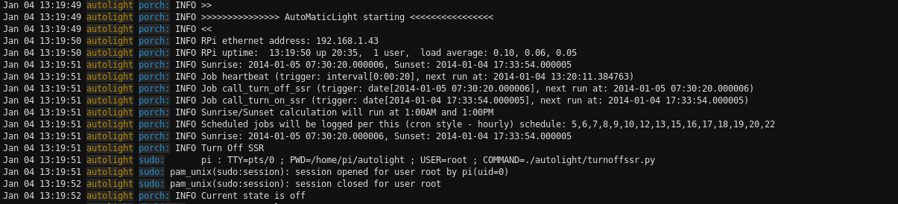
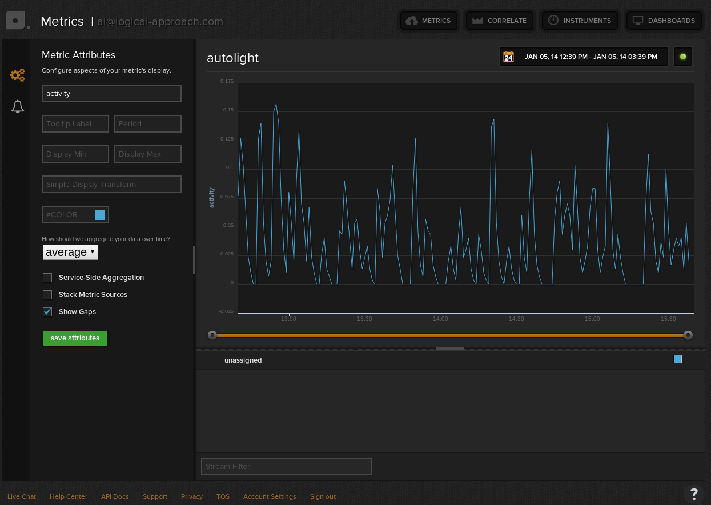

================
AutoLight-Photon
================

Introduction
------------

Like a lot of projects, this one was done to scratch an itch.
I was frustrated by several security lights that have
an automatic, light sensitive, control system that never seems to
be able to tell the difference between day and night!

Since day and night are governed by the position of the Sun, it
became clear that the only way to resolve my frustration was to 
calculate accurate times for Sunrise and Sunset and control the
security light on/off times with this knowledge.

Originally this code ran on a Raspberry Pi (RPi) and used the RPi digital
outputs signals to send the on/off control to the Solid State Relay (SSR)
board.  However, with the Photons clould API - this code can run anywhere
there's a machine with out-bound access to the internet.  Currently this
code is running in Googles Cloud (GCE) environment.

Yes I know that there are commercial sunrise/sunset switches 
available - but it's much more fun to build it yourself.

Design Goals
------------

The RPi Sunrise/Sunset should meet the following goals; it should:

* have a minimum number of mechanical parts for reliability.  

  * *solution:* use a Solid State Relay (SSR)

* maintain accurate time

  * *solution* configure Network Time Protocol (NTP) on the server running the application.

* given an connection to the internet it should log its actions - preferably via an on-line logging service.

  * *solution:* use **PaperTrail** (see below)

* given an internet connection, it should provide a visual *heartbeat*, preferably via an online service, so that it's *health* status can be quickly verified.

  * *solution:* use **Librato** (see below)

* be low-cost

* be reasonably safe - from an electrical standpoint.

  * *solution:* install a fuse in the A/C circuit.

* have a reasonably small code-base that is easy to maintain and extend for other applications.

  * *solution:* *Python* and it's high quality contributed software code-base **rocks**. [#]_

*"Build on the work or others"*
-----------------------------

This project would not be possible without the following *awesome* Python modules:

* **PyEphem** `provides an ephem Python package for performing high-precision astronomy computations <https://pypi.python.org/pypi/pyephem//>`_
* **APScheduler** `Advanced Python Scheduler <https://pypi.python.org/pypi/APScheduler/2.1.1/>`_

Recommended Parts List
----------------------

* RPi Model B with an ethernet connection to the internet *or* any (cloud) based Linux system to run the application code.

* A **Particle Photon** `WiFi based controller board <https://store.particle.io/?product=particle-photon>`_

* Solid State Relay (SSR) board 

  * for (up to a) 2 Amp load: use the **SainSmart** `2 channel 2A SSR board <http://www.sainsmart.com/arduino-compatibles-1/relay/solid-state-relay/sainsmart-2-channel-5v-solid-state-relay-module-board-omron-ssr-avr-dsp-arduino.html>`_
  * for (up to a) 5 Amp load: use the **SainSmart** `2 channel 5A SSR board <http://www.sainsmart.com/arduino-compatibles-1/relay/solid-state-relay/sainsmart-2-channel-ssr-2f-solid-state-relay-3v-32v-5a-for-avr-dsp-arduino-mega-uno-r3.html/>`_

* as an alternative to the SSR you can use a Mechanical Relay board with high quality relays.  Here are two alternatives:

  * A **Particle Relay Shield** `Has a socket for the Photon, 4 relays and a single power connector <https://store.particle.io/?product=relay-shield>`_

  * A **SainSmart** `2 channel 5 Volt relay board using high quality OMRON relays (similar to those used on the Particle Relay Shield ) <http://www.sainsmart.com/sainsmart-omron-5v-relay-opto-couple-for-arduino-uno-mega2560-r3-raspberry-pi-arm.html>`_

  * Note that if you don't use the Particle Relay Shield and you select a relay board that requires 12 volts, you'll need a 5 Volt power supply for the Photon and a 12 Volt supply for a (12 Volt) relay board.  Also - SainSmart has other relay boards that will work - but the relays are not as good as the OMRON relays you see recommended above.  
  
* Appropriate fuse and fuse holder (Radio Shack or your local hardware store)

Software Installation
---------------------

The application code runs on any Python 2.7.n version of Python.  Please install pip to manage the installation of the Python dependencies.  Note: there are many internet resources to describe how-to intall pip.

Installing Autolight-Photon is as simple as (running):

* git clone git@github.com:alhopper/autolight-photon.git

* Autolight requires the installation of some python library/module dependendies.  Install them as follows:
::

  sudo pip install ephem
  sudo pip install librato-metrics
  sudo pip install apscheduler==2.1.2

* Install the relay application on the Photon using the particle.io tools

* Sensitive data like the API key to access Librato and the keys used to access your Photon are stored in environment variables - rather than being hard-coded in the application code.  On a linux box (or the RPi), these environment variables are usually defined in $HOME/.bash_profile.   Here is a sample of what they should look like (using bogus values):
::

  export LIBRATOKEY=abcdef1234abcdef1234abcdef2134234234234abcd23423423abcdef2134234
  export PHOTONID=233333333344444445555555
  export PARTICLEIOACCESS=abcdef7444455555abcdef3333333abcdef32234

* to test the application, run it first from the command line as follows:
   
  * ./securitylight.py

* after fixing any problems, you can run it as a background process with a command like:

  * nohup ./securitylight.py >/dev/null 2>&1  &

Validatio nand Testing
----------------------

The codebase is small and simple and while there is never an excuse for a lack of automated 
testing, the only test that seems necessary, is one to establish the basic accuracy of the
Sunrise/Sunset calculations.  To validate the calculations, you'll find an *"eyeball"* (sorry)
test in the test subdirectory.  Execute the following standalones and *eyeball* the results:
::

  test/sunrisesunset-ephem.py
  test/sunrisesunset-usno.py

Recommended On-line Services
----------------------------
Both these sevice providers are **awesome**.  You may be able to stay within the *free* usage limits if you're just using them for this project.  But you will quickly start using them for many other projects!!  ;-)

**PaperTrail** `On-line Logging Service <https://papertrailapp.com/>`_

Here is a sample logging output |LOG|

**Librato** `On-line real-time dashboard/plotting service <https://metrics.librato.com/>`_

Here is a sample of the activity output plot |PLOT|

------------

.. [#] Python is a *first-class* supported development environment within the RPi eco-system.
